# ESP32 Talking Pet Button Matrix

<br />
<div align="center">
  <a href="https://github.com/avenhaus/Pet_Button">
    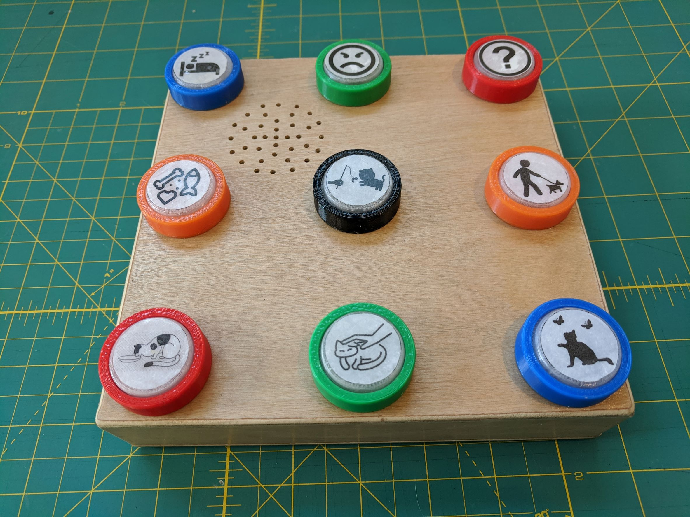
  </a>
</div>

## Overview

Buttons are arranged on 3 x 3 panels = 9 buttons, requiring 6 wires per panel.
The ESP32 provides 9 inputs by 6 outputs for a support of 6 panels (**54 buttons**) per ESP32.
The audio is stored in ESP32 internal FLASH and played via an I2S amplifier like [MAX98357A](https://www.aliexpress.com/premium/MAX98357A.html?SearchText=MAX98357A)

Current custom 3D printed button is designed for cats or small dogs. It uses a cheap, low profile PCB push button inside and optional SMD LED.

## Advantages

Advantages over commercially available singe recording buttons.

* Better quality and louder audio playback through large 3 watt speaker.
* Higher quality, normalized, de-noised and trimmed recordings using PC microphone and software like [Audacity](https://www.audacityteam.org/)
* Buttons illuminate for additional feedback.
* Much cheaper for large number of buttons.
* Your own choice of button size, feel, look, etc.
* Single, larger battery for all buttons
* Optional AC or USB power

## Build Instructions

### Buttons

* Print icon labels on regular paper.
* Cover with clear packing tape for protection.
* Cut to size with scissors.
* Use CA glue (Super Glue) to attach icons to button caps.
* Hot glue works great to make cheap, leveled non-slip rubber feet. Offset panel on a silicone mat while hot glue cools. (Hot glue removes easily with rubbing alcohol from most surfaces.)

### Audio

* Record audio as 44.1 kHz mono.
* Convert to .m4a (96 kbps) or .mp3 format. .wav works but takes more space.
* Save audio files to to data folder.
* Flash data folder to ESP32 SPIFFS.
* Map audio file to button in *files.h*

## Libraries

* [ESP32-audioI2S](https://github.com/schreibfaul1/ESP32-audioI2S)

## Notes

If there is a noticeable delay between pressing the button and the audio playing, this is due to the default Arduino boot loader being slow to wake up from deep sleep. This can be fixed by flashing a correctly configured IDF boot loader: *bootloader.bin* .

```
.platformio\packages\tool-esptoolpy\esptool.py --chip esp32 --port "COM5" --baud 460800 --before default_reset --after hard_reset write_flash -z --flash_mode dio --flash_freq 40m --flash_size detect 0x1000 bootloader.bin
```

A few of the ESP32 pins can not be switched to output. This means not all buttons can have be illuminated.

## Todo

* Easier audio management through ESP32 website
* OTA update
* PCB
* 3D printed case

## Images

### Stand alone panel for multiple locations or mobility.


### Multi panel setup with central audio box for maximum buttons
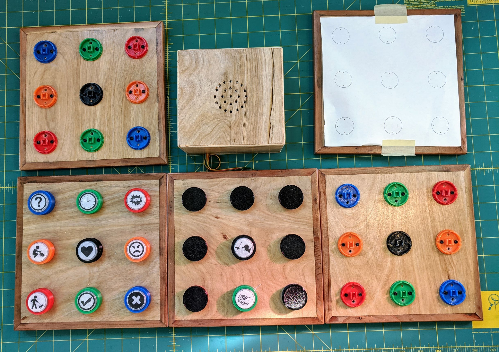

### Illuminated button
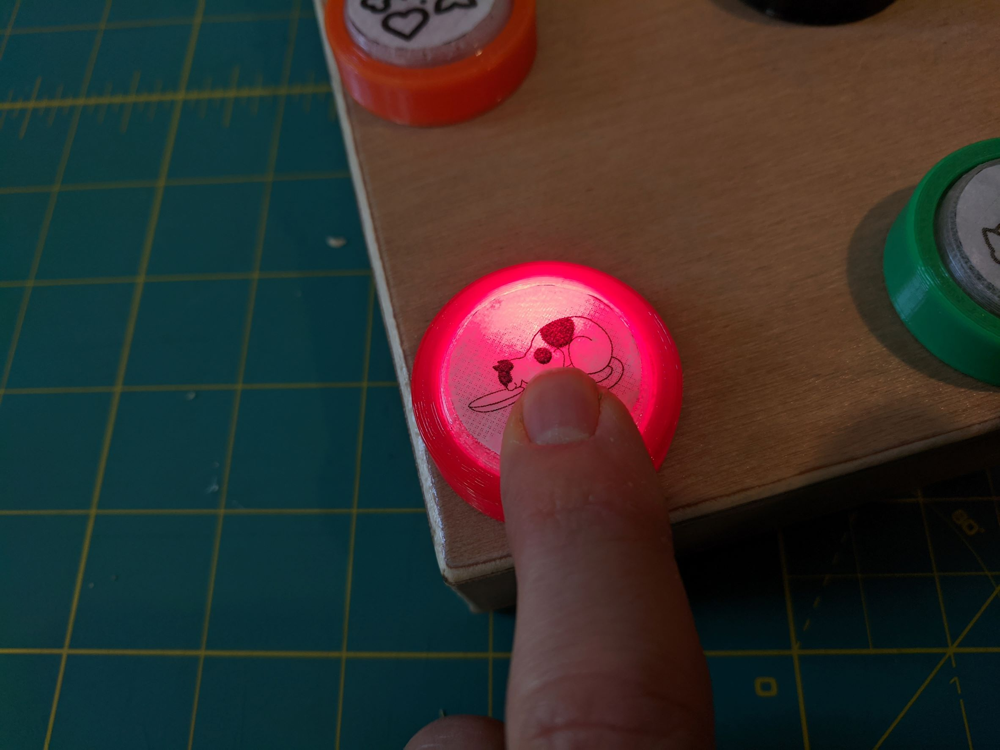

### Button uses cheap PCB push botton and SMD LED
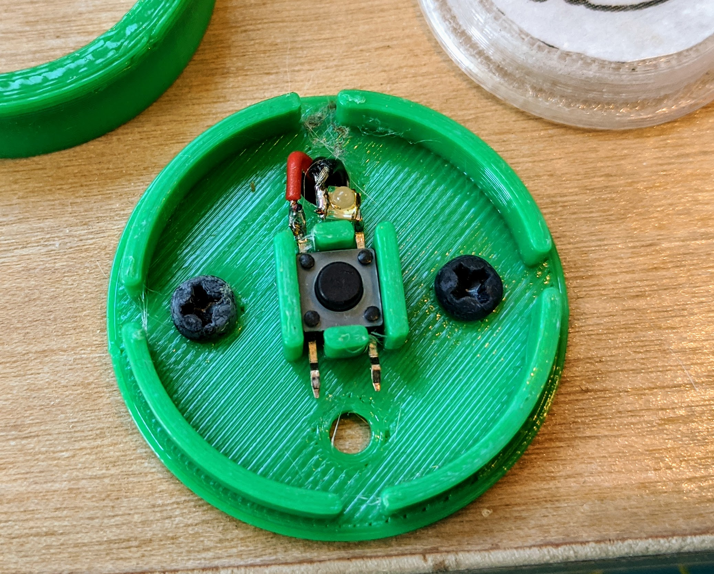

### Inside of Stand Alone Panel
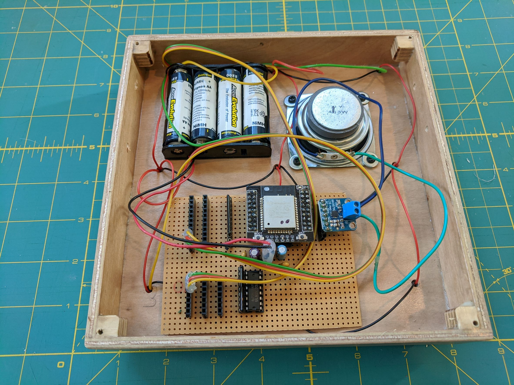

### Top of circuit board
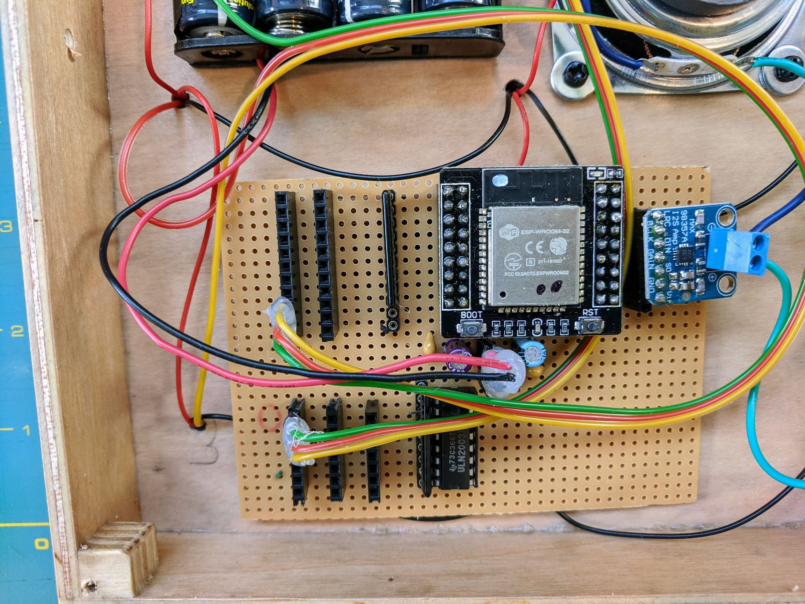

### Bottom of circuit board
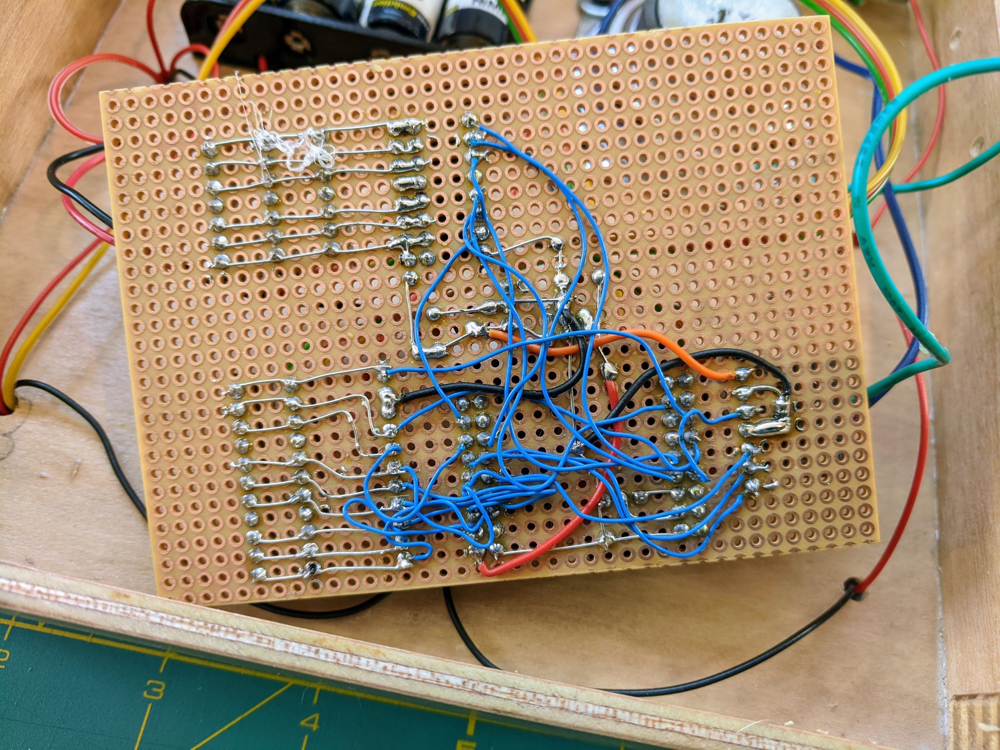

### Button panel wiring
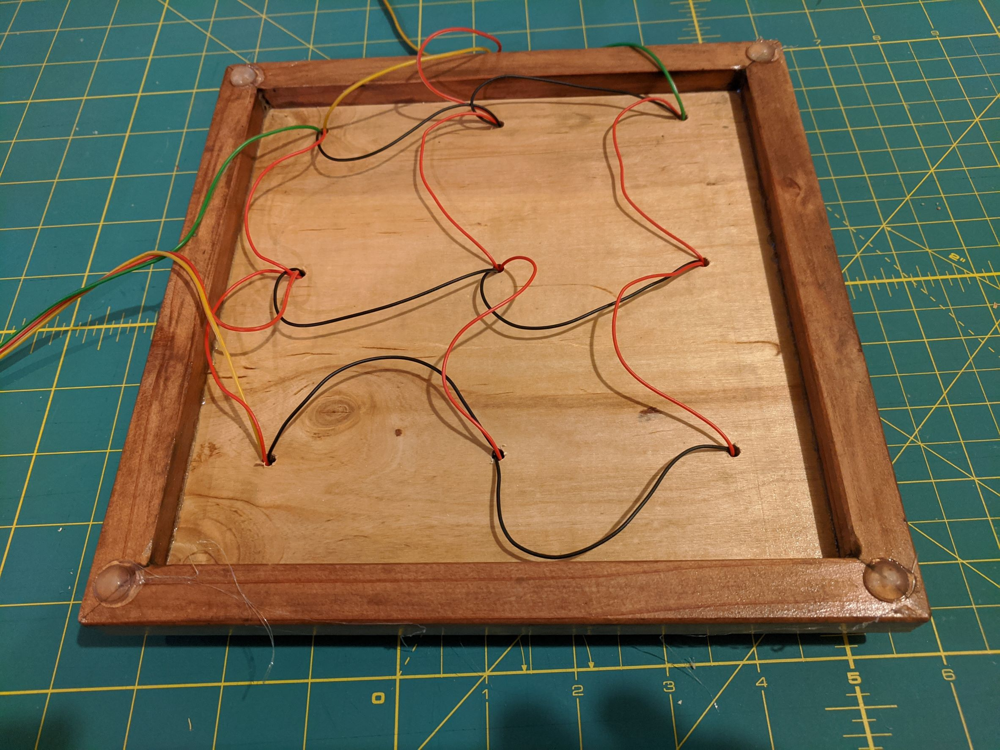

### Hot glue makes great feet
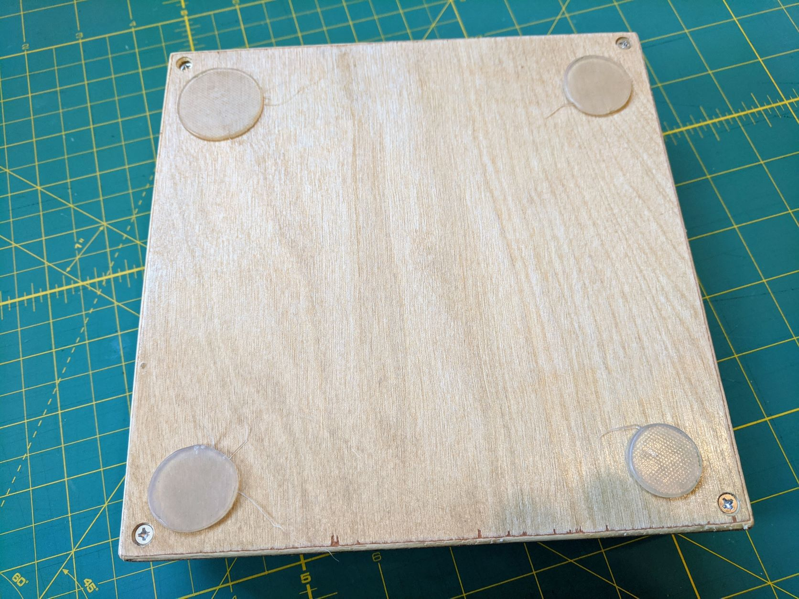

### 3D Button Rendering
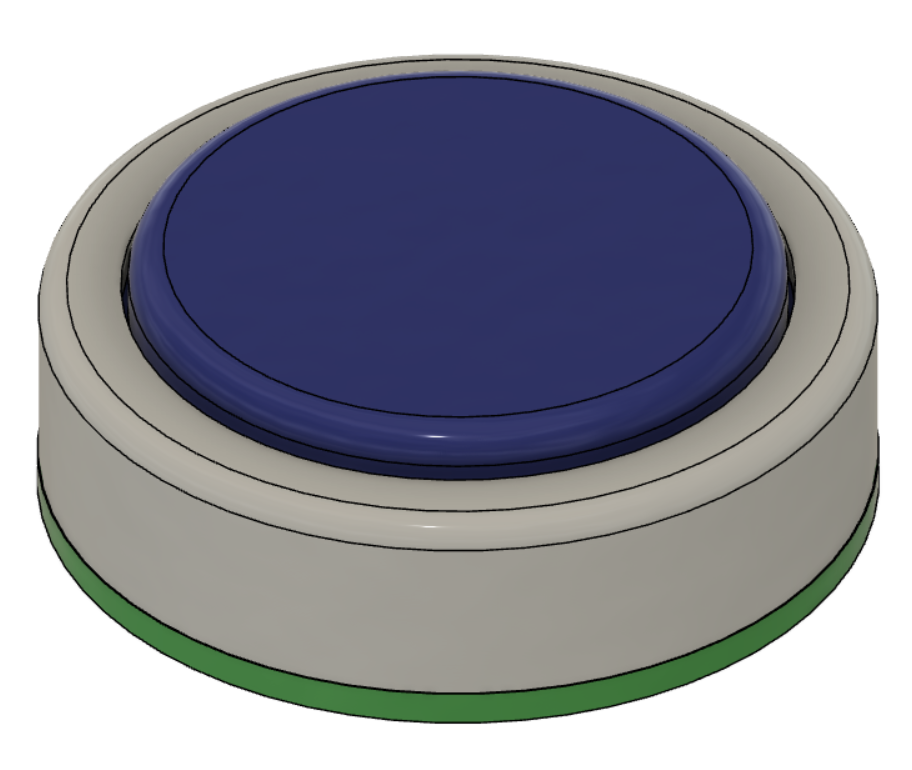

### Button cross section
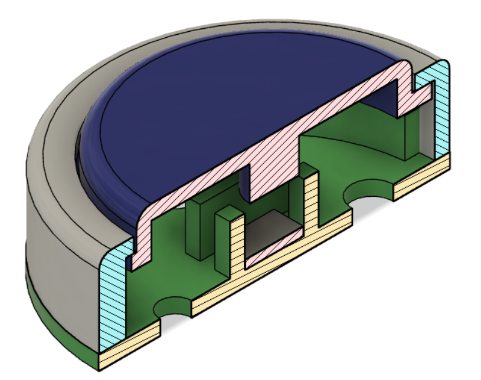
